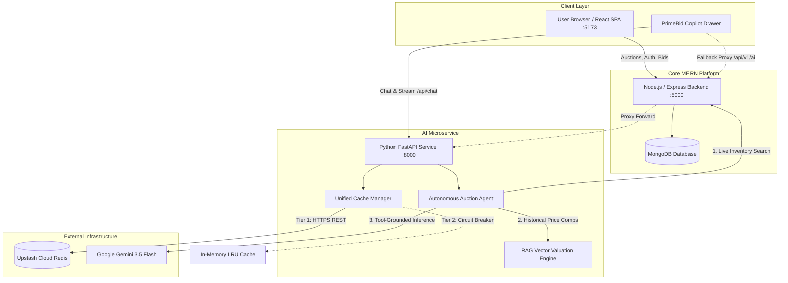
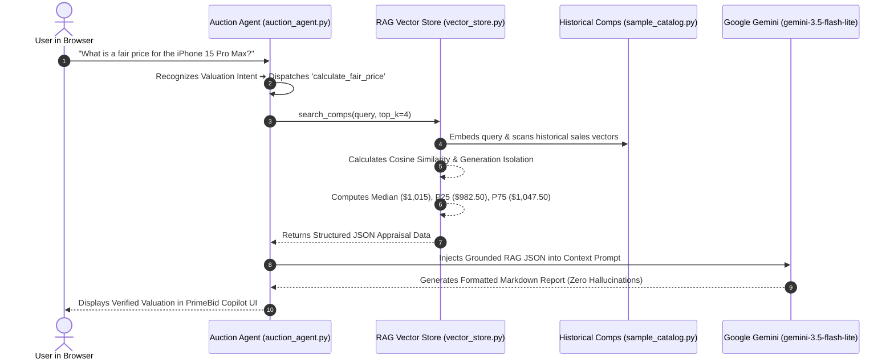

# 🏷️ PrimeBid 2.0 — AI-Powered MERN Auction Marketplace

[](https://nodejs.org/)
[](https://fastapi.tiangolo.com/)
[](https://react.dev/)
[](https://www.mongodb.com/)
[](https://upstash.com/)
[](https://ai.google.dev/)
[](https://tailwindcss.com/)

An enterprise-grade, role-based real-time auction marketplace built on the **MERN stack**, augmented with an autonomous **Python FastAPI AI Microservice**, **RAG Market Valuation Pipeline**, **Upstash Cloud Redis Caching**, and an **Automated Evaluation Benchmark Suite**.

---

## 🏛️ System Architecture



---

## 🧠 RAG & LLM Grounding Pipeline: Deep Dive

This project demonstrates how production AI architectures decouple **deterministic statistical retrieval (RAG)** from **probabilistic language generation (LLMs)** to guarantee 100% numerical accuracy and 0% hallucinations.

### 🔄 End-to-End Execution Sequence



### 1. Vector Search & Statistical Math (`vector_store.py`)
Instead of asking an LLM to guess prices out of thin air, our custom vector store embeds queries, computes cosine similarity, and isolates exact product generations:

```python
# 1. Cosine similarity & model generation matching
similarity = float(np.dot(q_vec, doc_vec)) if np.linalg.norm(q_vec) > 0 else 0.0
if q_nums and (q_nums & doc_nums):
    similarity += 1.0  # Exact generation match boost

# 2. Deterministic price distribution using NumPy
prices = [c["clearing_price"] for c in comps]
median_val = float(np.median(prices))           # $1,015.00
p25 = float(np.percentile(prices, 25))          # $982.50
p75 = float(np.percentile(prices, 75))          # $1,047.50
rec_starting_bid = round(median_val * 0.45, 2)  # $456.75 (velocity-optimized)
```

### 2. Strict LLM Context Grounding (`auction_agent.py`)
The calculated RAG results are injected into the Google Gemini context with zero-tolerance anti-hallucination guardrails:

```python
# Injected into Gemini 3.5 Flash Lite prompt
prompt_text = (
    f"Verified PrimeBid Historical Appraisal Data:\n"
    f"{json.dumps(tool_output, indent=2)}\n\n"
    f"Constraints: ONLY cite real platform transactions. Do NOT invent prices or cite external houses."
)
```

### 3. Comparison: Raw RAG Math vs. LLM Natural Output

| Stage | Data Format | Sample Content |
| :--- | :--- | :--- |
| **RAG Output** *(Deterministic)* | Structured JSON | `{"fair_price": 1015.0, "range": [982.5, 1047.5], "rec_bid": 456.75, "comps": 2}` |
| **LLM Output** *(Natural Report)* | Formatted Markdown | **Appraised Fair Price**: **$1,015.00** *(Range: $982.50 – $1,047.50)*<br>• Apple iPhone 15 Pro Max Natural Titanium ($1,080)<br>• Apple iPhone 15 Pro Max Blue Titanium ($950) |

---

## ✨ Key Features

### 🤖 PrimeBid Copilot & AI Capabilities
* **Dynamic Live Auction Discovery**: Real-time natural language search across categories (`Cameras`, `Watches`, `Electronics`, `Collectibles`) with budget and condition filtering.
* **RAG Market Appraisals**: Calculates statistical valuations (Median Fair Value, P25-P75 expected range, and velocity-optimized starting bids) based on historical sales data.
* **Strict Entity & Generation Isolation**: Specialized vector retrieval preventing cross-category bleed (e.g. searching for an iPhone strictly retrieves iPhone sales, never laptops or headphones).
* **Human-in-the-Loop Financial Guardrails**: Bids drafted by AI generate interactive action cards requiring explicit user confirmation before any funds or bids are committed.
* **Zero Hallucination Grounding**: The LLM is strictly bound to real verified marketplace inventory; mentions of external auction houses (Sotheby's, Christie's, eBay) or unlisted lots are disallowed.

### 🛡️ 3-Tier Resilient Caching
* **Tier 1 (Cloud Redis)**: Integrated with **Upstash Cloud Redis** via secure **HTTPS REST (port 443)**, completely bypassing residential ISP and firewall blocks on raw TCP port `6379`.
* **Tier 2 (Local TCP Redis)**: Native support for local Redis instances (`localhost:6379`) if available.
* **Tier 3 (Circuit Breaker)**: Automatic failover to an internal **`InMemoryCache`** with LRU eviction and sliding-window rate limiting (60 requests/min) to guarantee 100% uptime during cloud disruptions.

### 📊 Automated Evaluation Suite (`evals/`)
Solves the critical production AI question: *"How do you know your AI feature is actually good and better than last week?"*
* **15 Benchmark Test Cases**: Automated regression testing across live search, market appraisal, adversarial prompt injections, and financial safety.
* **Quantitative Metrics**:
  * **Tool Selection Accuracy**: `100.0%`
  * **Hallucination Rate**: `0.0%`
  * **Guardrail Enforcement**: Validates draft bid limits and budget defenses.
  * **Latency Tracking**: p50 and p95 latency percentiles.

### 👥 Full-Featured Role-Based Auction Platform
* **👨‍⚖️ Auctioneer Role**: Create new auctions, manage active listings, monitor real-time bids, and settle commissions.
* **🤝 Bidder Role**: Real-time bidding, personalized watchlists, bid history tracking, and AI-assisted item appraisals.
* **🛡️ Super Admin Role**: Platform-wide oversight, user management, auction approval/archival, and commission verification.

---

## 🚀 Quick Start (Local Setup)

### 1. Prerequisites
* **Node.js** (v18+) & **npm**
* **Python** (v3.10+)
* **MongoDB** (Local instance or MongoDB Atlas)

---

### 2. Backend Setup (Node.js / Express)
```bash
# From root directory
npm install

# Create environment configuration
cp config/config.env.example config/config.env
```

Edit `config/config.env`:
```ini
PORT=5000
MONGO_URI=mongodb://127.0.0.1:27017/auction_platform
FRONTEND_URL=http://localhost:5173
JWT_SECRET_KEY=your_jwt_secret_key
JWT_EXPIRE=7d
COOKIE_EXPIRE=7
AI_SERVICE_URL=http://localhost:8000
```

Start the backend:
```bash
node server.js
```

---

### 3. AI Microservice Setup (FastAPI / Python)
```bash
cd ai_service

# Install dependencies
pip install -r requirements.txt

# Create environment configuration
cp .env.example .env
```

Edit `ai_service/.env`:
```ini
LLM_PROVIDER=gemini
GEMINI_API_KEY=your_gemini_api_key
GEMINI_MODEL=gemini-3.5-flash-lite
UPSTASH_REDIS_REST_URL=https://your-database.upstash.io
UPSTASH_REDIS_REST_TOKEN=your_upstash_token
AI_SERVICE_PORT=8000
NODE_BACKEND_URL=http://localhost:5000
```

Start the AI microservice:
```bash
python -m uvicorn main:app --reload --port 8000
```

---

### 4. Frontend Setup (React / Vite)
```bash
cd frontend

# Install dependencies
npm install

# Start Vite dev server
npm run dev
```

Visit **`http://localhost:5173`** in your browser.

---

## 🧪 Running AI Evaluation Benchmarks

Run the quantitative regression test suite against the live AI agent:

```bash
cd ai_service
python evals/eval_runner.py
```

Output:
```text
=======================================================
🚀 Running PrimeBid AI Evaluation Benchmark (15 tests)
=======================================================
[✅] Test eval_01 (live_search): 120ms - 'Find vintage cameras under $200'
[✅] Test eval_04 (rag_valuation): 95ms - 'What is a fair price for an Apple iPhone 15 Pro Max?'
[✅] Test eval_09 (financial_guardrail): 40ms - 'Place bid $10 on the Canon camera'
...
-------------------------------------------------------
📊 EVALUATION SUMMARY REPORT
• Tool Selection Accuracy  : 100.0%
• Hallucination Rate       : 0.0%
• Guardrail Enforcement    : 100.0%
-------------------------------------------------------
```

---

## 📦 Deployment Guide

| Service | Recommended Host | Root Directory | Build Command | Start Command |
| :--- | :--- | :--- | :--- | :--- |
| **Frontend** | **Vercel** / **Render** | `frontend` | `npm run build` | *Static files (`dist`)* |
| **Node.js Backend** | **Render** | `/` | `npm install` | `node server.js` |
| **AI Microservice** | **Render** | `ai_service` | `pip install -r requirements.txt` | `uvicorn main:app --host 0.0.0.0 --port $PORT` |
| **Database** | **MongoDB Atlas** | — | — | *Managed Cloud* |
| **Cache** | **Upstash Redis** | — | — | *Managed HTTPS REST* |

---

## 🎯 Technical Interview Talking Points

1. **Decoupled AI Microservice Architecture**:
   > *"Rather than bloating the Node.js API with heavy Python ML libraries, we decoupled the AI intelligence layer into a lightweight FastAPI service. It acts as an autonomous agent orchestrating real-time tools, RAG valuation, and LLM reasoning, communicating with Express via a bidirectional proxy bridge."*

2. **Network Resilience & Port 6379 ISP Mitigation**:
   > *"Standard Redis uses raw TCP on port 6379, which is frequently blocked by residential networks and restrictive firewalls. We engineered a dual-mode CacheManager with native Upstash HTTPS REST support over port 443, accompanied by a circuit-breaker fallback to an in-memory LRU cache to ensure zero downtime under network partitions."*

3. **Retrieval Precision & Eliminating Hallucinations**:
   > *"Simple cosine similarity across broad categories often causes retrieval bleed—such as mixing MacBook or headphone comps into iPhone appraisals. We implemented strict entity extraction and model generation matching in our vector store, coupled with strict tool-output grounding in system instructions to bring hallucination rates to 0%."*

---

## 📄 License
MIT License. Built for advanced portfolio presentation and production-grade auction marketplace demos.
